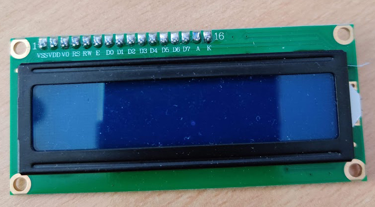
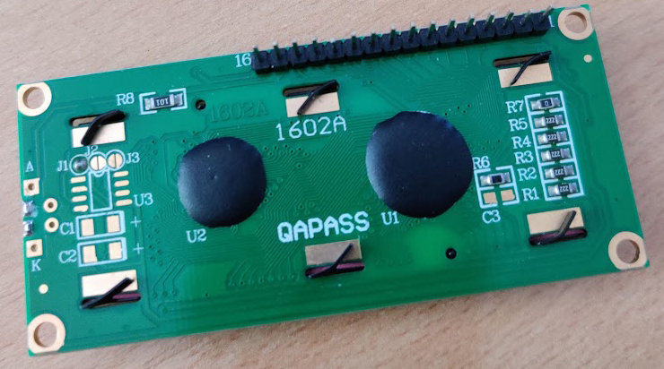
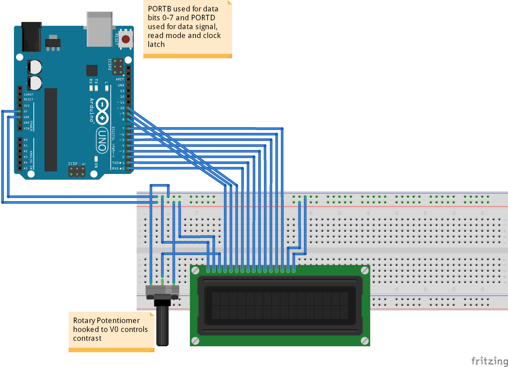
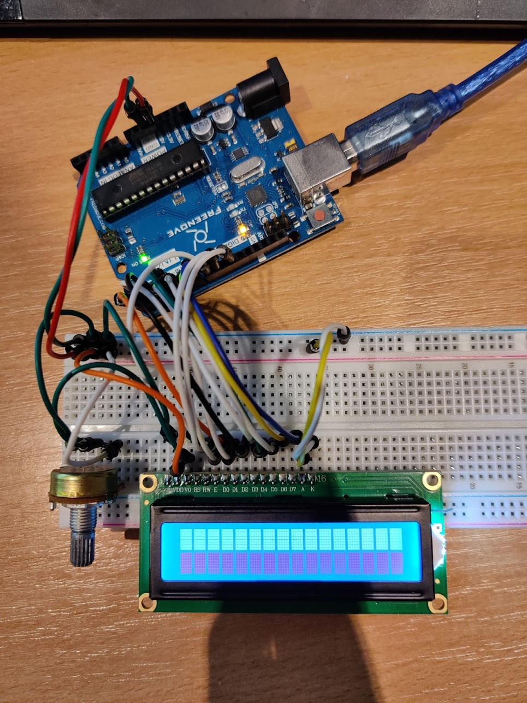
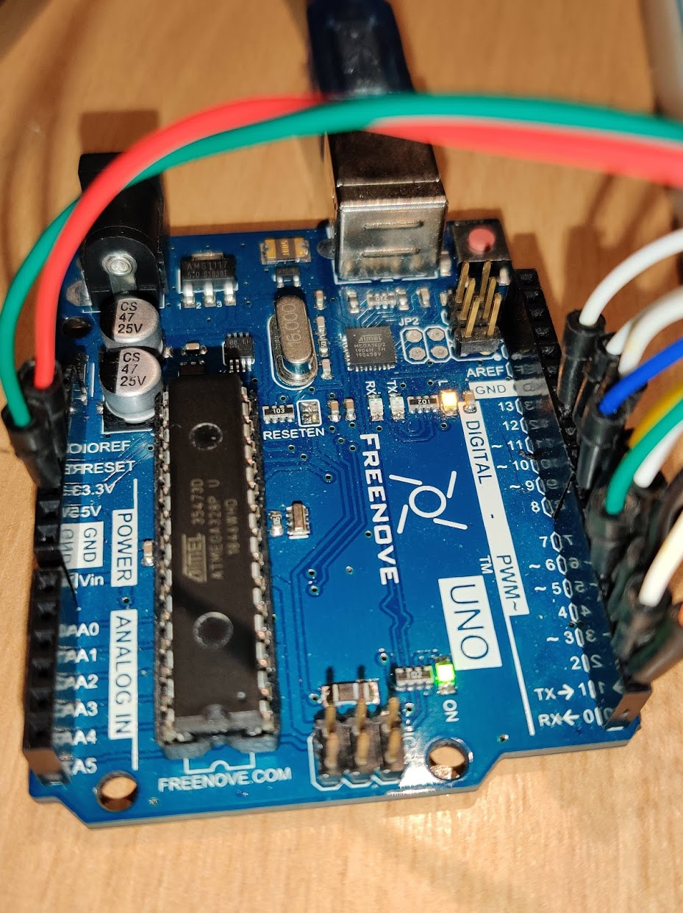
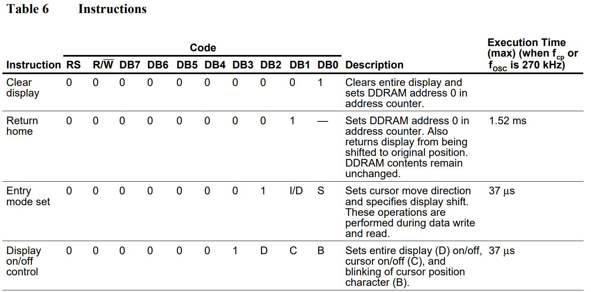
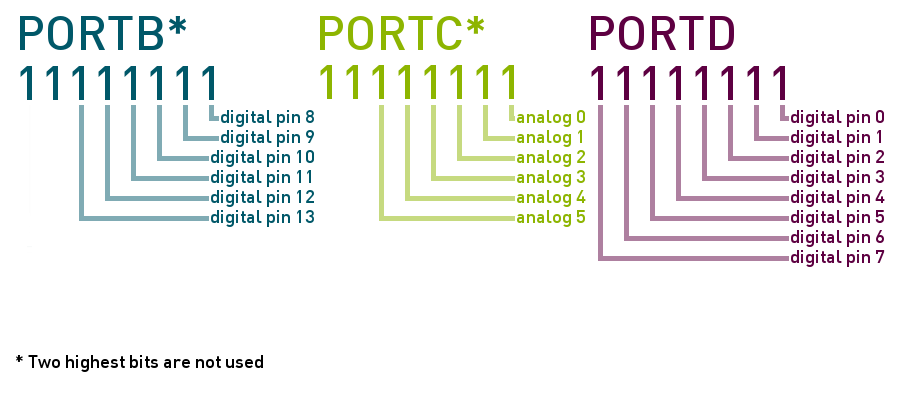
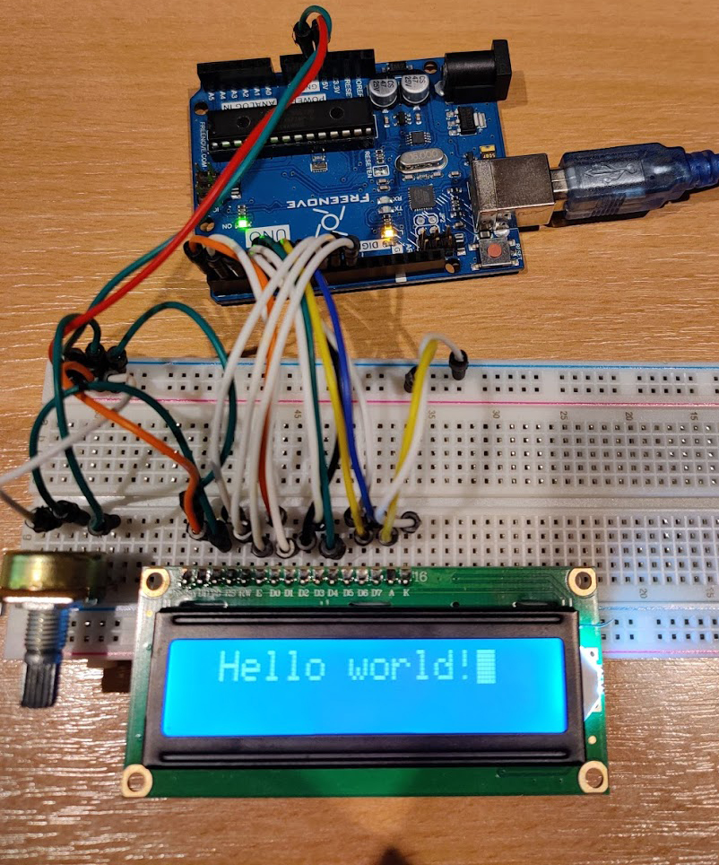

# Hitachi-HD44780-LCD-Controller
## My attempt at writing code to control a TC1602B­01 (HD44780 compatible) LCD module without any LCD specific libraries.

## *Note that this is NOT a library. It is very opinionated code based on a specific wiring setup. It was solely used as a learning exercise.*

I haven't done any electronics based stuff in a while so figured I needed a fairly interesting project to get back into the flow of things. I have an LCD module (Tinsharp TC1602B­01) sitting in my box of electronics along with an Arduino so figured I'd wire them up and write the control code myself to hopefully renew my knowledge and learn a thing or two along the way.





## The plan
The majority of the control signals that get sent to the screen are done so via the 8 (D0-D7) data bus pins that are visible on the front of the module. Now sending data to these pins individually sounds (and is) a pain, so luckily we can make use of the Arduino's port registers to allow quicker and more efficient access to these pins via the code. We can send out a byte of data at once as opposed to 8 individual calls to a digital write function doing a bit at a time. This makes for faster and more lightweight code.

First of all, we need to wire everything up - here's a schematic I threw together before starting:


(one thing to note is that having pins 0 and 1 in use by our program may cause issues when flashing the board. I had issues with avrdude during this step. Simply disconnecting the jumpers solves this and you can reconnect them straight after.)

And my somewhat accurate recreation:




You can see 8 data bus bits are wired into PORTD (pins 0 through 7 on the Arduino) and the control signals and clock latch pins (RS, RW and E) wired into the lesser 3 bits of PORTB.

GPIO pins aren't needed for power nor ground so those are wired into the regular 5V and GND pins on the far side of the board.

## Steps to reach 'hello world'
The first thing I did was to take a look at the datasheet for the HD44780. This is a 60 page monstrosity, but we only need some of these pages (notably the instruction table and initialisation sections).

Datasheet available at https://www.sparkfun.com/datasheets/LCD/HD44780.pdf

A snippet of the instruction table shown below can give you an idea of how each instruction is given: 


Each instruction is comprised of 10 bits. There are 8 data bits (DB0 through 7) and then the register select and read/write bits. The register select bit determines whether data sent from the MPU lands in the driver's instruction register or data register. As the majority of the instructions aren't actually sending data, RS is left low for the majority of operations.

Each instruction's byte of data bus bits contains both the instruction and any parameters that instruction requires. Parameters are given after the first 1 occurs in this byte (which is also presumably how the HD44780 determines which instruction it's actually being given). A hurdle I stumbled across at the start was completely missing the fact that each instruction has some execution time alloted to it. The Arduino's clock cycle time is far faster than these execution times, so suffucient delays are required after each instruction is sent to the driver to avoid sending things too fast and causing timing errors.

After the control (RS & RW) and the 8 data bus bits are set, you trigger the instruction execution on the driver by pulsing the clock latch bit (E). Raise it high and then zero it instantly.

Prior to sending anything to the LCD driver, we need to set the Arduino's data direction registers to match our intended use of them (in terms of IO). As all we are doing is output on all of the pins we are using, we can set `DDRD` to `0xFF` and `DDRB` to `0x07`. This corresponds to the Uno's GPIO pins 0 to 7 and 8 to 10 respectively, as shown in the wiring schematic.

Imagine looking at the GPIO pins from above with the Arduino the right way up, the lesser bits of the port registers are linked to the lower digital IO pins, and the first set (0 to 7) and the second set (8 - 13) are split over `PORTD` and `PORTD`. Setting `1`'s in these two port's data direction registers tells the Arduino that those pins are for output.

In other words, `DDRD = 0x01;` is the same as:

```
pinMode(0, OUTPUT);
pinMode(1, INPUT);
pinMode(2, INPUT);
pinMode(3, INPUT);
pinMode(4, INPUT);
pinMode(5, INPUT);
pinMode(6, INPUT);
pinMode(7, INPUT);
```



-Picture from https://www.peterbeard.co/postimages/digitalwrite/bits-to-pins.png

## An example instruction
So let's send instruction 4 (display on/off control) as an example. RS and RW are zero, so we simply zero all control signals (including the clock latch for now): `PORTB = 0;`. The instruction itself is a byte, 3 of which are parameters. Say we wanted to turn on the display on, with a cursor and make that cursor blink. That's a `1` for all parameters. So the whole instruction is `00001111` (`0x0F`). To send this to the instruction register via the 8 data bus bits we can use the wiring to our advantage and do `PORTD = 0x0F;` So `PORTD` and `PORTB` are set, let's execute it. Pulse the clock latch bit while not changing the two other control bits, and immediately return it to zero:

```
PORTB |= 0x04;
PORTB &= ~0x04;
```

After this, we call `delayMicroseconds` to allow a sufficient amount of time for the LCD driver to do what we just asked it to do. When this timer has elapsed, we are free to send another instruction.

The instruction order for getting hello world working:
1. function set (one or two line mode)
2. display on/off (set to on, clearly)
3. entry mode set (so cursor increments correctly)
4. write data (for each character in the string we want to display)

# End result
Voila!




# Some of the things I learnt:
- port registers
- low level bit shifting put into practice
- avoiding some simple (yet irritating) timing bugs
